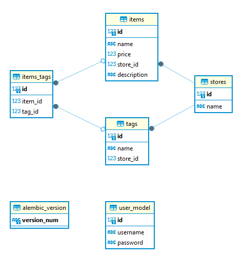

Schémas Marshmallow
===================

En bref, les schémas Marshmallow peuvent être utilisés pour : 

    * Valider les données d'entrée.
    
    * Désérialiser les données d'entrée en objets au niveau de l'application. 

    * Sérialiser les objets au niveau de l'application en types Python primitifs. Les objets sérialisés peuvent ensuite être restitués dans des formats standard tels que JSON pour être utilisés dans une API HTTP.

Chaque classe devra ensuite être importée dans tout module de *Ressources* amené à travailler sur ces données ou objets.

---

.. automodule:: schemas
    :members: